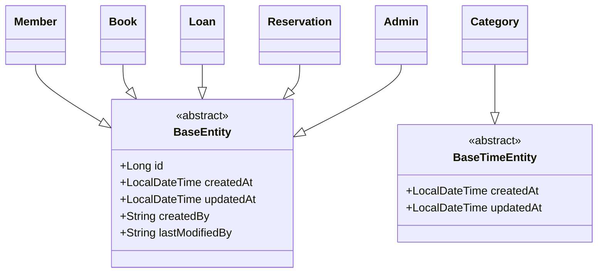

# Entity 설계서

## 문서 정보
- **프로젝트명**: [프로젝트명]
- **작성자**: [팀명/작성자명]
- **작성일**: [YYYY-MM-DD]
- **버전**: [v1.0]
- **검토자**: [백엔드 개발자명]
- **승인자**: [팀 리더명]

---

## 1. Entity 설계 개요

### 1.1 설계 목적
> JPA Entity 클래스 설계를 통해 객체-관계 매핑(ORM)을 정의하고, 
> 비즈니스 도메인을 코드로 표현하여 유지보수가 용이한 시스템을 구축

### 1.2 설계 원칙
- **단일 책임 원칙**: 하나의 Entity는 하나의 비즈니스 개념만 표현
- **캡슐화**: 비즈니스 로직을 Entity 내부에 구현
- **불변성**: 가능한 한 불변 객체로 설계
- **연관관계 최소화**: 필요한 관계만 매핑하여 복잡도 감소

### 1.3 기술 스택
- **ORM 프레임워크**: Spring Data JPA 2.7.x
- **데이터베이스**: MariaDB 10.11
- **검증 프레임워크**: Bean Validation 2.0
- **감사 기능**: Spring Data JPA Auditing

---

## 2. Entity 목록 및 분류

### 2.1 Entity 분류 매트릭스
| Entity명 | 유형 | 비즈니스 중요도 | 기술적 복잡도 | 연관관계 수 | 우선순위 |
|----------|------|----------------|---------------|-------------|----------|
| **Member** | 핵심 | 높음 | 중간 | 4개 | 1순위 |
| **Book** | 핵심 | 높음 | 중간 | 3개 | 1순위 |
| **Loan** | 핵심 | 높음 | 높음 | 3개 | 1순위 |
| **Category** | 지원 | 중간 | 낮음 | 2개 | 2순위 |
| **Reservation** | 지원 | 중간 | 중간 | 2개 | 2순위 |
| **Admin** | 지원 | 중간 | 낮음 | 1개 | 3순위 |
| **LoanHistory** | 이력 | 낮음 | 낮음 | 2개 | 3순위 |

### 2.2 Entity 상속 구조


---

## 3. 공통 설계 규칙

### 3.1 네이밍 규칙
| 구분 | 규칙 | 예시 | 비고 |
|------|------|------|------|
| **Entity 클래스명** | PascalCase | `Member`, `BookCategory` | 단수형 사용 |
| **테이블명** | snake_case | `members`, `book_categories` | 복수형 사용 |
| **컬럼명** | snake_case | `member_id`, `created_at` | 언더스코어 구분 |
| **연관관계 필드** | camelCase | `memberLoans`, `bookCategory` | 객체 참조명 |
| **boolean 필드** | is + 형용사 | `isActive`, `isDeleted` | 명확한 의미 |

### 3.2 공통 어노테이션 규칙
```java
// 기본 Entity 구조
@Entity
@Table(name = "테이블명")
@EntityListeners(AuditingEntityListener.class)
@NoArgsConstructor(access = AccessLevel.PROTECTED)
@Getter
public class EntityName extends BaseEntity {
    // 필드 정의
}
```

### 3.3 ID 생성 전략
| Entity | 전략 | 이유 | 예시 |
|--------|------|------|------|
| **Member** | IDENTITY | MariaDB Auto Increment 활용 | 1, 2, 3, ... |
| **Book** | IDENTITY | 단순한 순차 증가 | 1, 2, 3, ... |
| **Loan** | IDENTITY | 대출 순서 보장 | 1, 2, 3, ... |
| **Category** | IDENTITY | 계층 구조 지원 | 1, 2, 3, ... |

---

## 4. 상세 Entity 설계

### 4.1 Member Entity

#### 4.1.1 기본 정보
```java
@Entity
@Table(name = "members", indexes = {
    @Index(name = "idx_member_number", columnList = "member_number"),
    @Index(name = "idx_email", columnList = "email"),
    @Index(name = "idx_status", columnList = "status")
})
@EntityListeners(AuditingEntityListener.class)
@NoArgsConstructor(access = AccessLevel.PROTECTED)
@Getter
public class Member extends BaseEntity {
    // 필드 정의 (아래 상세 명세 참조)
}
```

#### 4.1.2 필드 상세 명세
| 필드명 | 데이터 타입 | 컬럼명 | 제약조건 | 설명 | 비즈니스 규칙 |
|--------|-------------|--------|----------|------|---------------|
| **id** | `Long` | `member_id` | PK, NOT NULL, AUTO_INCREMENT | 회원 고유 식별자 | 시스템 자동 생성 |
| **memberNumber** | `String` | `member_number` | UNIQUE, NOT NULL, LENGTH(10) | 회원번호 | M + 9자리 숫자 |
| **name** | `String` | `name` | NOT NULL, LENGTH(50) | 회원명 | 2-50자 한글/영문 |
| **email** | `String` | `email` | UNIQUE, NOT NULL, LENGTH(100) | 이메일 | 로그인 ID 겸용 |
| **password** | `String` | `password` | NOT NULL, LENGTH(255) | 암호화된 비밀번호 | BCrypt 암호화 |
| **phoneNumber** | `String` | `phone_number` | LENGTH(15) | 전화번호 | 010-1234-5678 형식 |
| **birthDate** | `LocalDate` | `birth_date` | NULL 허용 | 생년월일 | 통계 목적 |
| **address** | `String` | `address` | LENGTH(200) | 주소 | 선택 항목 |
| **status** | `MemberStatus` | `status` | NOT NULL, ENUM | 회원 상태 | ACTIVE, SUSPENDED, WITHDRAWN |
| **maxLoanCount** | `Integer` | `max_loan_count` | NOT NULL, DEFAULT(5) | 최대 대출 권수 | 1-10 범위 |

#### 4.1.3 연관관계 매핑
```java
// 1:N - 회원의 대출 목록
@OneToMany(mappedBy = "member", cascade = CascadeType.ALL, fetch = FetchType.LAZY)
@OrderBy("createdAt DESC")
private List<Loan> loans = new ArrayList<>();

// 1:N - 회원의 예약 목록
@OneToMany(mappedBy = "member", cascade = CascadeType.ALL, fetch = FetchType.LAZY)
@OrderBy("createdAt DESC")
private List<Reservation> reservations = new ArrayList<>();
```

### 4.2 Book Entity

#### 4.2.1 필드 상세 명세
| 필드명 | 데이터 타입 | 컬럼명 | 제약조건 | 설명 | 비즈니스 규칙 |
|--------|-------------|--------|----------|------|---------------|
| **id** | `Long` | `book_id` | PK, NOT NULL, AUTO_INCREMENT | 도서 고유 식별자 | 시스템 자동 생성 |
| **isbn** | `String` | `isbn` | UNIQUE, NOT NULL, LENGTH(13) | ISBN | 13자리 숫자만 |
| **title** | `String` | `title` | NOT NULL, LENGTH(200) | 도서명 | 필수 입력 |
| **author** | `String` | `author` | NOT NULL, LENGTH(100) | 저자 | 필수 입력 |
| **publisher** | `String` | `publisher` | LENGTH(100) | 출판사 | 선택 입력 |
| **publicationDate** | `LocalDate` | `publication_date` | NULL 허용 | 출간일 | 선택 입력 |
| **totalCopies** | `Integer` | `total_copies` | NOT NULL, MIN(1) | 총 보유 권수 | 1 이상 |
| **availableCopies** | `Integer` | `available_copies` | NOT NULL, MIN(0) | 대출 가능 권수 | 0 이상 |
| **price** | `BigDecimal` | `price` | PRECISION(10,2) | 도서 가격 | 선택 입력 |
| **description** | `String` | `description` | TEXT | 도서 설명 | 선택 입력 |
| **imageUrl** | `String` | `image_url` | LENGTH(500) | 표지 이미지 URL | 선택 입력 |
| **pageCount** | `Integer` | `page_count` | MIN(1) | 페이지 수 | 선택 입력 |
| **language** | `String` | `language` | LENGTH(10), DEFAULT('KO') | 언어 코드 | KO, EN, JP 등 |
| **isActive** | `Boolean` | `is_active` | NOT NULL, DEFAULT(true) | 활성 여부 | 소프트 삭제용 |

#### 4.2.2 구현 코드 예시
```java
@Entity
@Table(name = "books", indexes = {
    @Index(name = "idx_isbn", columnList = "isbn"),
    @Index(name = "idx_title", columnList = "title"),
    @Index(name = "idx_author", columnList = "author"),
    @Index(name = "idx_category", columnList = "category_id"),
    @Index(name = "idx_available", columnList = "available_copies")
})
@EntityListeners(AuditingEntityListener.class)
@NoArgsConstructor(access = AccessLevel.PROTECTED)
@Getter
public class Book extends BaseEntity {

    @Column(nullable = false, unique = true, length = 13)
    @Pattern(regexp = "^\\d{13}$", message = "ISBN은 13자리 숫자여야 합니다")
    private String isbn;

    @Column(nullable = false, length = 200)
    @NotBlank(message = "제목은 필수입니다")
    @Size(max = 200, message = "제목은 200자를 초과할 수 없습니다")
    private String title;

    @Column(nullable = false, length = 100)
    @NotBlank(message = "저자는 필수입니다")
    private String author;

    @Column(name = "total_copies", nullable = false)
    @Min(value = 1, message = "총 권수는 1 이상이어야 합니다")
    private Integer totalCopies;

    @Column(name = "available_copies", nullable = false)
    @Min(value = 0, message = "대출가능 권수는 0 이상이어야 합니다")
    private Integer availableCopies;

    // ManyToOne - 카테고리
    @ManyToOne(fetch = FetchType.LAZY)
    @JoinColumn(name = "category_id", nullable = false)
    private Category category;

    // OneToMany - 대출 이력
    @OneToMany(mappedBy = "book", cascade = CascadeType.ALL, fetch = FetchType.LAZY)
    private List<Loan> loans = new ArrayList<>();

    // 비즈니스 메서드
    public boolean isAvailable() {
        return availableCopies > 0 && isActive;
    }

    public void decreaseAvailableCopies() {
        if (availableCopies <= 0) {
            throw new IllegalStateException("대출 가능한 책이 없습니다");
        }
        this.availableCopies--;
    }

    public void increaseAvailableCopies() {
        if (availableCopies >= totalCopies) {
            throw new IllegalStateException("반납할 수 있는 책이 없습니다");
        }
        this.availableCopies++;
    }
}
```

### 4.3 Loan Entity

#### 4.3.1 필드 상세 명세
| 필드명 | 데이터 타입 | 컬럼명 | 제약조건 | 설명 | 비즈니스 규칙 |
|--------|-------------|--------|----------|------|---------------|
| **id** | `Long` | `loan_id` | PK, NOT NULL, AUTO_INCREMENT | 대출 고유 식별자 | 시스템 자동 생성 |
| **loanNumber** | `String` | `loan_number` | UNIQUE, NOT NULL, LENGTH(12) | 대출번호 | L + YYYYMMDD + 4자리 |
| **loanDate** | `LocalDate` | `loan_date` | NOT NULL | 대출일 | 승인일 기준 |
| **dueDate** | `LocalDate` | `due_date` | NOT NULL | 반납예정일 | 대출일 + 14일 |
| **returnDate** | `LocalDate` | `return_date` | NULL 허용 | 실제반납일 | 반납 시 입력 |
| **status** | `LoanStatus` | `status` | NOT NULL, ENUM | 대출상태 | REQUESTED, APPROVED, BORROWED, RETURNED, OVERDUE, CANCELLED |
| **overdueFee** | `BigDecimal` | `overdue_fee` | PRECISION(10,2), DEFAULT(0) | 연체료 | 1일당 100원 |
| **notes** | `String` | `notes` | TEXT | 비고 | 선택 입력 |

#### 4.3.2 구현 코드 예시
```java
@Entity
@Table(name = "loans", indexes = {
    @Index(name = "idx_loan_number", columnList = "loan_number"),
    @Index(name = "idx_member_status", columnList = "member_id, status"),
    @Index(name = "idx_book_status", columnList = "book_id, status"),
    @Index(name = "idx_due_date", columnList = "due_date"),
    @Index(name = "idx_status", columnList = "status")
})
@EntityListeners(AuditingEntityListener.class)
@NoArgsConstructor(access = AccessLevel.PROTECTED)
@Getter
public class Loan extends BaseEntity {

    @Column(name = "loan_number", unique = true, nullable = false, length = 12)
    private String loanNumber;

    @Column(name = "loan_date", nullable = false)
    private LocalDate loanDate;

    @Column(name = "due_date", nullable = false)
    private LocalDate dueDate;

    @Column(name = "return_date")
    private LocalDate returnDate;

    @Enumerated(EnumType.STRING)
    @Column(nullable = false)
    private LoanStatus status = LoanStatus.REQUESTED;

    @Column(name = "overdue_fee", precision = 10, scale = 2)
    private BigDecimal overdueFee = BigDecimal.ZERO;

    // ManyToOne 관계
    @ManyToOne(fetch = FetchType.LAZY)
    @JoinColumn(name = "member_id", nullable = false)
    private Member member;

    @ManyToOne(fetch = FetchType.LAZY)
    @JoinColumn(name = "book_id", nullable = false)
    private Book book;

    @ManyToOne(fetch = FetchType.LAZY)
    @JoinColumn(name = "approved_by")
    private Admin approvedBy;

    // 비즈니스 메서드
    public boolean isOverdue() {
        return status == LoanStatus.BORROWED && 
               LocalDate.now().isAfter(dueDate);
    }

    public long getOverdueDays() {
        if (!isOverdue()) {
            return 0;
        }
        return ChronoUnit.DAYS.between(dueDate, LocalDate.now());
    }

    public BigDecimal calculateOverdueFee() {
        if (!isOverdue()) {
            return BigDecimal.ZERO;
        }
        return BigDecimal.valueOf(getOverdueDays())
                .multiply(new BigDecimal("100")); // 1일당 100원
    }

    public void approve(Admin admin) {
        if (this.status != LoanStatus.REQUESTED) {
            throw new IllegalStateException("승인 가능한 상태가 아닙니다");
        }
        if (!book.isAvailable()) {
            throw new IllegalStateException("대출 가능한 도서가 아닙니다");
        }
        
        this.status = LoanStatus.APPROVED;
        this.approvedBy = admin;
        this.loanDate = LocalDate.now();
        this.dueDate = this.loanDate.plusDays(14);
        
        // 도서 재고 감소
        book.decreaseAvailableCopies();
    }

    public void returnBook() {
        if (status != LoanStatus.BORROWED && status != LoanStatus.OVERDUE) {
            throw new IllegalStateException("반납할 수 있는 상태가 아닙니다");
        }
        
        this.returnDate = LocalDate.now();
        this.status = LoanStatus.RETURNED;
        this.overdueFee = calculateOverdueFee();
        
        // 도서 재고 증가
        book.increaseAvailableCopies();
    }
}
```

---

## 5. Enum 타입 정의

### 5.1 MemberStatus
```java
public enum MemberStatus {
    ACTIVE("활성", "정상적으로 서비스 이용 가능"),
    SUSPENDED("정지", "일시적으로 서비스 이용 정지"),
    WITHDRAWN("탈퇴", "서비스 탈퇴 완료");

    private final String displayName;
    private final String description;

    MemberStatus(String displayName, String description) {
        this.displayName = displayName;
        this.description = description;
    }

    public String getDisplayName() {
        return displayName;
    }

    public String getDescription() {
        return description;
    }

    public boolean isActive() {
        return this == ACTIVE;
    }
}
```

### 5.2 LoanStatus
```java
public enum LoanStatus {
    REQUESTED("신청", "대출 신청 상태"),
    APPROVED("승인", "관리자가 승인한 상태"),
    BORROWED("대출중", "실제 대출이 진행 중인 상태"),
    RETURNED("반납완료", "정상 반납 완료"),
    OVERDUE("연체", "반납일을 초과한 상태"),
    CANCELLED("취소", "대출 신청이 취소된 상태");

    private final String displayName;
    private final String description;

    LoanStatus(String displayName, String description) {
        this.displayName = displayName;
        this.description = description;
    }

    public boolean isActiveStatus() {
        return this == BORROWED || this == OVERDUE;
    }

    public boolean isCompletedStatus() {
        return this == RETURNED || this == CANCELLED;
    }
}
```

---

## 6. 연관관계 매핑 전략

### 6.1 연관관계 매핑 규칙
| 관계 유형 | 기본 전략 | 이유 | 예외 상황 |
|----------|-----------|------|-----------|
| **@ManyToOne** | LAZY | 성능 최적화 | 필수 조회 데이터는 EAGER |
| **@OneToMany** | LAZY | N+1 문제 방지 | 소량 데이터는 EAGER |
| **@OneToOne** | LAZY | 일관성 유지 | 항상 함께 조회하는 경우 EAGER |
| **@ManyToMany** | 사용 금지 | 복잡성 증가 | 중간 테이블로 대체 |

### 6.2 Cascade 옵션 가이드
```java
// 부모-자식 관계 (강한 연결)
@OneToMany(mappedBy = "member", cascade = CascadeType.ALL, orphanRemoval = true)
private List<Loan> loans = new ArrayList<>();

// 참조 관계 (약한 연결)
@ManyToOne(fetch = FetchType.LAZY)
@JoinColumn(name = "category_id")
private Category category; // cascade 없음

// 선택적 관계
@OneToMany(mappedBy = "book", cascade = {CascadeType.PERSIST, CascadeType.MERGE})
private List<Reservation> reservations = new ArrayList<>();
```

### 6.3 양방향 연관관계 관리
```java
// Member Entity에서
public void addLoan(Loan loan) {
    loans.add(loan);
    loan.setMember(this); // 양방향 연관관계 동기화
}

public void removeLoan(Loan loan) {
    loans.remove(loan);
    loan.setMember(null);
}

// Loan Entity에서
public void setMember(Member member) {
    // 기존 관계 제거
    if (this.member != null) {
        this.member.getLoans().remove(this);
    }
    
    this.member = member;
    
    // 새로운 관계 설정
    if (member != null && !member.getLoans().contains(this)) {
        member.getLoans().add(this);
    }
}
```

---

## 7. 감사(Auditing) 설정

### 7.1 BaseEntity 구현
```java
@MappedSuperclass
@EntityListeners(AuditingEntityListener.class)
@Getter
public abstract class BaseEntity {

    @Id
    @GeneratedValue(strategy = GenerationType.IDENTITY)
    @Column(name = "id")
    private Long id;

    @CreatedDate
    @Column(name = "created_at", nullable = false, updatable = false)
    private LocalDateTime createdAt;

    @LastModifiedDate
    @Column(name = "updated_at")
    private LocalDateTime updatedAt;

    @CreatedBy
    @Column(name = "created_by", updatable = false)
    private String createdBy;

    @LastModifiedBy
    @Column(name = "last_modified_by")
    private String lastModifiedBy;

    @Version
    @Column(name = "version")
    private Long version;

    // equals, hashCode는 id 기반으로 구현
    @Override
    public boolean equals(Object o) {
        if (this == o) return true;
        if (o == null || getClass() != o.getClass()) return false;
        BaseEntity that = (BaseEntity) o;
        return Objects.equals(id, that.id);
    }

    @Override
    public int hashCode() {
        return Objects.hash(id);
    }
}
```

### 7.2 Auditing 설정
```java
@Configuration
@EnableJpaAuditing
public class JpaAuditingConfig {

    @Bean
    public AuditorAware<String> auditorProvider() {
        return () -> {
            // Spring Security에서 현재 사용자 정보 조회
            Authentication authentication = SecurityContextHolder.getContext().getAuthentication();
            
            if (authentication == null || !authentication.isAuthenticated()) {
                return Optional.of("SYSTEM");
            }
            
            return Optional.of(authentication.getName());
        };
    }
}
```

---

## 8. 성능 최적화 전략

### 8.1 인덱스 설계 전략
```java
// 복합 인덱스 - 자주 함께 조회되는 컬럼
@Table(name = "loans", indexes = {
    @Index(name = "idx_member_status", columnList = "member_id, status"),
    @Index(name = "idx_book_status_date", columnList = "book_id, status, loan_date"),
    @Index(name = "idx_due_date_status", columnList = "due_date, status")
})

// 단일 인덱스 - 검색 조건으로 자주 사용
@Index(name = "idx_loan_number", columnList = "loan_number", unique = true)
@Index(name = "idx_created_at", columnList = "created_at")
```

### 8.2 N+1 문제 해결
```java
// Repository에서 fetch join 사용
public interface LoanRepository extends JpaRepository<Loan, Long> {
    
    @Query("SELECT l FROM Loan l " +
           "JOIN FETCH l.member m " +
           "JOIN FETCH l.book b " +
           "JOIN FETCH b.category " +
           "WHERE l.status = :status")
    List<Loan> findByStatusWithDetails(@Param("status") LoanStatus status);
    
    // @EntityGraph 사용
    @EntityGraph(attributePaths = {"member", "book", "book.category"})
    List<Loan> findByMemberIdAndStatus(Long memberId, LoanStatus status);
}
```

### 8.3 쿼리 최적화
```java
// 페이징과 정렬
@Query("SELECT l FROM Loan l " +
       "WHERE l.member.id = :memberId " +
       "ORDER BY l.createdAt DESC")
Page<Loan> findByMemberIdOrderByCreatedAtDesc(
    @Param("memberId") Long memberId, 
    Pageable pageable);

// 집계 쿼리
@Query("SELECT COUNT(l) FROM Loan l " +
       "WHERE l.member.id = :memberId " +
       "AND l.status = :status")
long countByMemberIdAndStatus(
    @Param("memberId") Long memberId, 
    @Param("status") LoanStatus status);

// 조건부 쿼리 (Specifications 활용)
public class LoanSpecifications {
    public static Specification<Loan> hasStatus(LoanStatus status) {
        return (root, query, criteriaBuilder) ->
            status == null ? null : criteriaBuilder.equal(root.get("status"), status);
    }
    
    public static Specification<Loan> isOverdue() {
        return (root, query, criteriaBuilder) ->
            criteriaBuilder.and(
                criteriaBuilder.equal(root.get("status"), LoanStatus.BORROWED),
                criteriaBuilder.lessThan(root.get("dueDate"), LocalDate.now())
            );
    }
}
```

---

## 9. 검증 및 제약조건

### 9.1 Bean Validation 어노테이션
```java
// 커스텀 검증 어노테이션
@Target({ElementType.FIELD})
@Retention(RetentionPolicy.RUNTIME)
@Constraint(validatedBy = ISBNValidator.class)
public @interface ValidISBN {
    String message() default "유효하지 않은 ISBN입니다";
    Class<?>[] groups() default {};
    Class<? extends Payload>[] payload() default {};
}

// 검증 구현 클래스
public class ISBNValidator implements ConstraintValidator<ValidISBN, String> {
    
    @Override
    public boolean isValid(String isbn, ConstraintValidatorContext context) {
        if (isbn == null || isbn.length() != 13) {
            return false;
        }
        
        // ISBN-13 체크섬 검증 로직
        try {
            int sum = 0;
            for (int i = 0; i < 12; i++) {
                int digit = Character.getNumericValue(isbn.charAt(i));
                sum += (i % 2 == 0) ? digit : digit * 3;
            }
            int checkDigit = 10 - (sum % 10);
            if (checkDigit == 10) checkDigit = 0;
            
            return checkDigit == Character.getNumericValue(isbn.charAt(12));
        } catch (NumberFormatException e) {
            return false;
        }
    }
}

// Entity에서 사용
@ValidISBN
@Column(nullable = false, unique = true, length = 13)
private String isbn;
```

### 9.2 데이터베이스 제약조건
```java
// 체크 제약조건
@Entity
@Table(name = "books", 
    uniqueConstraints = {
        @UniqueConstraint(columnNames = {"isbn"}),
        @UniqueConstraint(columnNames = {"title", "author", "publisher"})
    },
    // MySQL에서는 체크 제약조건 대신 트리거 사용
    indexes = {
        @Index(name = "idx_isbn", columnList = "isbn"),
        @Index(name = "idx_title_author", columnList = "title, author")
    }
)
public class Book extends BaseEntity {
    
    // JPA 수준에서 검증
    @PrePersist
    @PreUpdate
    private void validateConstraints() {
        if (availableCopies > totalCopies) {
            throw new IllegalArgumentException(
                "대출가능 권수는 총 권수를 초과할 수 없습니다");
        }
        if (totalCopies < 1) {
            throw new IllegalArgumentException(
                "총 권수는 1 이상이어야 합니다");
        }
    }
}
```

---

## 10. 테스트 전략

### 10.1 Entity 단위 테스트
```java
@DisplayName("Member Entity 테스트")
class MemberTest {

    @Test
    @DisplayName("회원 생성 시 기본값이 올바르게 설정되어야 한다")
    void createMember_ShouldSetDefaultValues() {
        // given
        String name = "김철수";
        String email = "kim@test.com";
        String password = "password123";
        
        // when
        Member member = Member.createMember(name, email, password, null, null, null);
        
        // then
        assertThat(member.getStatus()).isEqualTo(MemberStatus.ACTIVE);
        assertThat(member.getMaxLoanCount()).isEqualTo(5);
        assertThat(member.getMemberNumber()).startsWith("M");
        assertThat(member.getMemberNumber()).hasSize(10);
    }

    @Test
    @DisplayName("추가 대출 가능 여부를 올바르게 판단해야 한다")
    void canLoanMore_ShouldReturnCorrectResult() {
        // given
        Member member = createTestMember();
        
        // 현재 5권 대출 중 (최대 대출 권수)
        for (int i = 0; i < 5; i++) {
            Loan loan = createActiveLoan(member);
            member.getLoans().add(loan);
        }
        
        // when & then
        assertThat(member.canLoanMore()).isFalse();
    }

    @Test
    @DisplayName("연체 도서 보유 여부를 올바르게 판단해야 한다")
    void hasOverdueLoans_ShouldReturnTrue_WhenOverdueLoansExist() {
        // given
        Member member = createTestMember();
        Loan overdueLoan = createOverdueLoan(member);
        member.getLoans().add(overdueLoan);
        
        // when & then
        assertThat(member.hasOverdueLoans()).isTrue();
    }
}
```

### 10.2 Repository 테스트
```java
@DataJpaTest
@DisplayName("LoanRepository 테스트")
class LoanRepositoryTest {

    @Autowired
    private TestEntityManager entityManager;

    @Autowired
    private LoanRepository loanRepository;

    @Test
    @DisplayName("회원 ID와 상태로 대출 목록을 조회해야 한다")
    void findByMemberIdAndStatus_ShouldReturnLoans() {
        // given
        Member member = createAndSaveMember();
        Book book = createAndSaveBook();
        Loan loan = createAndSaveLoan(member, book, LoanStatus.BORROWED);
        
        // when
        List<Loan> result = loanRepository.findByMemberIdAndStatus(
            member.getId(), LoanStatus.BORROWED);
        
        // then
        assertThat(result).hasSize(1);
        assertThat(result.get(0).getId()).isEqualTo(loan.getId());
    }

    @Test
    @DisplayName("연체된 대출 목록을 조회해야 한다")
    void findOverdueLoans_ShouldReturnOverdueLoans() {
        // given
        Member member = createAndSaveMember();
        Book book = createAndSaveBook();
        Loan overdueLoan = createAndSaveLoan(member, book, LoanStatus.BORROWED);
        
        // 반납예정일을 과거로 설정
        overdueLoan.setDueDate(LocalDate.now().minusDays(1));
        entityManager.persistAndFlush(overdueLoan);
        
        // when
        List<Loan> result = loanRepository.findOverdueLoans();
        
        // then
        assertThat(result).hasSize(1);
        assertThat(result.get(0).isOverdue()).isTrue();
    }
}
```

---

## 11. 성능 모니터링

### 11.1 쿼리 성능 모니터링
```properties
# application.properties - 쿼리 성능 모니터링 설정

# 로깅 레벨 설정
logging.level.org.hibernate.SQL=DEBUG
logging.level.org.hibernate.type.descriptor.sql.BasicBinder=TRACE
logging.level.org.hibernate.stat=DEBUG
logging.level.org.springframework.jdbc.core=DEBUG

# DB 접속정보
spring.datasource.url=jdbc:mariadb://localhost:3306/library_db
spring.datasource.username=lab
spring.datasource.password=lab
spring.datasource.driverClassName=org.mariadb.jdbc.Driver

# JPA 및 Hibernate 설정
spring.jpa.show-sql=true
spring.jpa.properties.hibernate.format_sql=true
spring.jpa.properties.hibernate.use_sql_comments=true
spring.jpa.properties.hibernate.generate_statistics=true
spring.jpa.properties.hibernate.session.events.log.LOG_QUERIES_SLOWER_THAN_MS=1000

# 하이버네이트 통계 정보 활성화
spring.jpa.properties.hibernate.stats.enabled=true
spring.jpa.properties.hibernate.cache.use_second_level_cache=false
spring.jpa.properties.hibernate.cache.use_query_cache=false

# 배치 처리 최적화
spring.jpa.properties.hibernate.jdbc.batch_size=50
spring.jpa.properties.hibernate.order_inserts=true
spring.jpa.properties.hibernate.order_updates=true
spring.jpa.properties.hibernate.jdbc.batch_versioned_data=true

# 커넥션 풀 설정 (HikariCP)
spring.datasource.hikari.maximum-pool-size=20
spring.datasource.hikari.minimum-idle=5
spring.datasource.hikari.connection-timeout=20000
spring.datasource.hikari.idle-timeout=300000
spring.datasource.hikari.max-lifetime=1200000
spring.datasource.hikari.leak-detection-threshold=60000

# 1초 이상 걸리는 쿼리 자동 감지
spring.jpa.properties.hibernate.session.events.log.LOG_QUERIES_SLOWER_THAN_MS=1000

# 개발환경용 추가 설정
spring.jpa.properties.hibernate.highlight_sql=true
spring.jpa.properties.hibernate.type=trace
```

### 11.1.1 환경별 설정

**개발환경 (application-dev.properties)**
```properties
# 개발환경 - 상세한 로깅 및 디버깅
logging.level.org.hibernate.SQL=DEBUG
logging.level.org.hibernate.type.descriptor.sql.BasicBinder=TRACE
logging.level.com.library=DEBUG

spring.jpa.show-sql=true
spring.jpa.properties.hibernate.format_sql=true
spring.jpa.properties.hibernate.use_sql_comments=true
spring.jpa.properties.hibernate.generate_statistics=true

# H2 Console 활성화 (개발용)
spring.h2.console.enabled=true
spring.h2.console.path=/h2-console
```

**테스트환경 (application-test.properties)**
```properties
# 테스트환경 - 최소한의 로깅
logging.level.org.hibernate.SQL=INFO
spring.jpa.show-sql=false
spring.jpa.properties.hibernate.format_sql=false

# 테스트 데이터베이스 설정
spring.datasource.url=jdbc:h2:mem:testdb
spring.jpa.hibernate.ddl-auto=create-drop
```

**운영환경 (application-prod.properties)**
```properties
# 운영환경 - 성능 최적화 중심
logging.level.org.hibernate.SQL=WARN
logging.level.org.hibernate.type.descriptor.sql.BasicBinder=WARN
spring.jpa.show-sql=false

# 운영 최적화 설정
spring.jpa.properties.hibernate.format_sql=false
spring.jpa.properties.hibernate.use_sql_comments=false
spring.jpa.properties.hibernate.generate_statistics=true

# 커넥션 풀 최적화
spring.datasource.hikari.maximum-pool-size=50
spring.datasource.hikari.minimum-idle=10
spring.datasource.hikari.connection-timeout=30000

```

### 11.2 슬로우 쿼리 감지
```java
@Component
@Slf4j
public class QueryPerformanceInterceptor implements Interceptor {
    
    private static final long SLOW_QUERY_THRESHOLD = 1000; // 1초
    
    @Override
    public boolean onLoad(Object entity, Serializable id, Object[] state, 
                         String[] propertyNames, Type[] types) {
        long startTime = System.currentTimeMillis();
        
        return new Runnable() {
            @Override
            public void run() {
                long endTime = System.currentTimeMillis();
                long executionTime = endTime - startTime;
                
                if (executionTime > SLOW_QUERY_THRESHOLD) {
                    log.warn("슬로우 쿼리 감지: {}ms, Entity: {}, ID: {}", 
                            executionTime, entity.getClass().getSimpleName(), id);
                }
            }
        };
    }
}
```

---

## 12. 체크리스트 및 검토 항목

### 12.1 설계 완성도 체크리스트
```
□ 모든 Entity에 @Entity 어노테이션이 적용되었는가?
□ 테이블명과 컬럼명이 명명 규칙을 따르는가?
□ Primary Key 전략이 일관되게 적용되었는가?
□ 필요한 인덱스가 모두 정의되었는가?
□ 연관관계 매핑이 올바르게 설정되었는가?
□ 비즈니스 메서드가 Entity에 포함되었는가?
□ 감사(Auditing) 기능이 적용되었는가?
□ 성능 최적화가 고려되었는가?
□ 검증 어노테이션이 적절히 사용되었는가?
```

### 12.2 코드 품질 체크리스트
```
□ 모든 필드에 적절한 접근 제어자가 설정되었는가?
□ 불변 객체 원칙이 최대한 적용되었는가?
□ 생성자와 팩토리 메서드가 적절히 구현되었는가?
□ 예외 처리가 비즈니스 메서드에 포함되었는가?
□ 코드 중복이 최소화되었는가?
□ 주석과 문서화가 충분한가?
□ 테스트 코드가 작성되었는가?
□ 코딩 컨벤션이 일관되게 적용되었는가?
```

### 12.3 성능 체크리스트
```
□ N+1 쿼리 문제가 해결되었는가?
□ 적절한 페치 전략(LAZY/EAGER)이 적용되었는가?
□ 필요한 인덱스가 모두 생성되었는가?
□ 쿼리 최적화가 적용되었는가?
□ 데이터베이스 커넥션 풀이 적절히 설정되었는가?
```
---

## 14. 마무리

### 14.1 주요 포인트 요약
1. **도메인 중심 설계**: 비즈니스 로직을 Entity에 캡슐화
2. **성능 최적화**: 인덱스, 페치 전략, 쿼리 최적화 고려
3. **일관된 규칙**: 명명 규칙, 어노테이션 사용법 통일
4. **검증 및 제약조건**: 데이터 무결성 보장
5. **테스트 가능성**: 단위 테스트와 통합 테스트 고려

---

