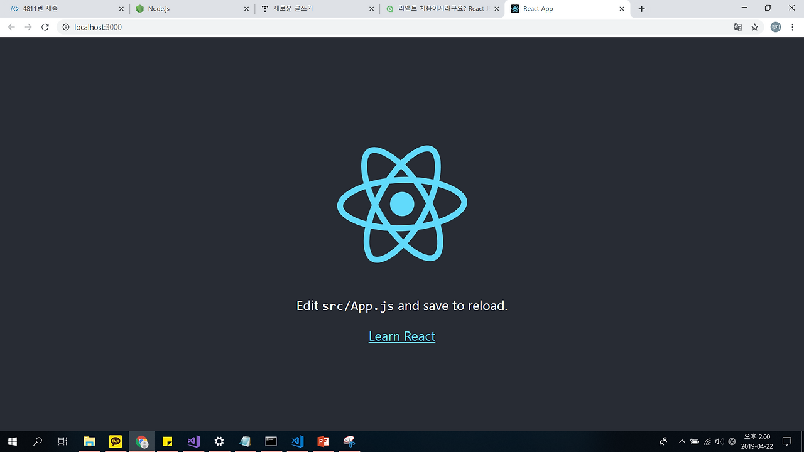

# React 화면 설계서 문서 템플릿

## 문서 정보
- **작성자**: [작성자명]
- **작성일**: [YYYY-MM-DD]
- **버전**: [v1.0]
- **검토자**: [검토자명]

## 화면 구조 설계

### 레이아웃 구성
```
┌─────────────────────────────────┐
│           Header                │
├─────────────────────────────────┤
│ Sidebar │      Main Content     │
│         │                       │
│         │                       │
│         │                       │
├─────────┼───────────────────────┤
│         │        Footer         │
└─────────┴───────────────────────┘
```

### 주요 섹션
| 섹션명 | 위치 | 역할 | 필수여부 |
|--------|------|------|----------|
| [Header] | 상단 | [역할 설명] | 필수 |
| [Navigation] | 좌측 | [역할 설명] | 선택 |
| [Content Area] | 중앙 | [역할 설명] | 필수 |
| [Sidebar] | 우측 | [역할 설명] | 선택 |
| [Footer] | 하단 | [역할 설명] | 선택 |


## 화면 개요

### 화면 목적
- **주요 기능**: [이 화면에서 사용자가 수행할 수 있는 주요 작업]
- **사용자 그룹**: [이 화면을 사용할 대상 사용자]

### 화면 분류
- **화면 타입**: [ ] 목록 화면 [ ] 상세 화면 [ ] 입력 화면 [ ] 대시보드 [ ] 기타
- **권한 레벨**: [ ] 공개 [ ] 로그인 필요 [ ] 관리자 전용 [ ] 특정 권한 필요

### 화면 캡쳐
```

```

---


